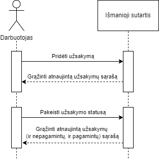
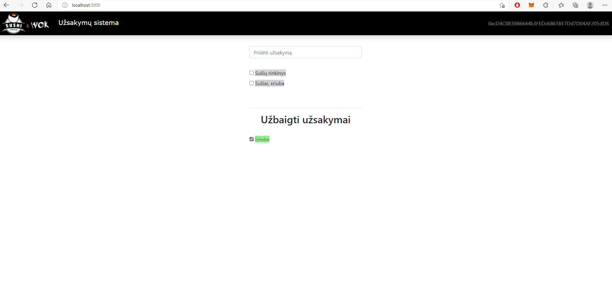

# VU-Smart-Contract
Repository for a decentralized blockchain application for the VU Blockchain course.

This tutorial was a huge help for this project:
[Dapp University Tutorial](https://www.dappuniversity.com/articles/blockchain-app-tutorial)

## Getting started
First of all, after cloning the repository, you need to install a couple of packages and programs - NodeJS, Truffle, Ganache and npm. 

The rest can be installed through the listed dependencies by typing
```npm install``` 
into Git Bash.

Then, after opening Ganache, type (once again in Git Bash) ```truffle compile``` and ```truffle migrate --reset``` to migrate this smart contract.

Finally, you can (once again in Git Bash) type ```npm run dev``` and go to ```http://localhost:3000``` to see the decentralized application in action!

Note. You can use ```truffle test``` to run 4 tests that ensure that everything is working:
```shell
Contract: Uzsakymai
    √ deployinimo testavimas
    √ uzsakymu isvardinimo testavimas (147ms)
    √ uzsakymu kurimo testavimas (590ms)
    √ uzsakymu statuso pakeitimo testavimas (2073ms)


  4 passing (3s)
```
This is how it should look like after compiling if everything is in order.

## Business model logic

This application was made to register orders for a restaurant. A worker can enter the information of the order and change its status (i.e. if it's completed or not).

The logic is presented in this sequence diagram:



## Front-end

This is how the application's front-end looks like:



You can see the connected account in the top right corner of the page.

The input box for the orders is in the middle of the page, along with the current and completed orders (which are shown below the input box).
